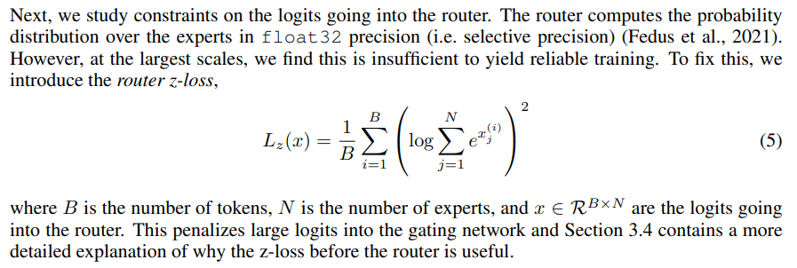
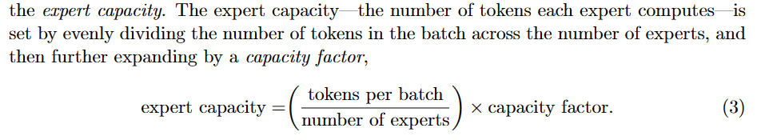

# Mixture of Experts (MoE)

Authors: Ding Zhang, Yuchen Wang, Chiao-Wei Hsu, and Yufeng Zou 

## 

## MoE Introduction

## Outline:
1. History: 
    1. Introduction: Experts as Components, Conditional Computation
    3. Models:
        1. GShard (yf)
        2. Switch (yf)
        3. Mistral

Mistral:
2. Architectural differences between the vanilla Transformer and Mistral (zd)
3. Sliding Window Attention (zd)
4. KV-Cache (yuchen)
5. Sparse Mixture of Experts (zd)
6. Model Sharding / Expert Parallelism (yuchen)
7. Stabilizing training with router Z-loss (Chiao)
8. Capacity Factor and Communication costs (Chiao)

9. Understanding the Mistral model's code


## Mistral and Mixtral
**Mistral**, or more formally, **Mistral-7B**, was first introduced in this [blogpost](https://mistral.ai/news/announcing-mistral-7b/) by Albert Jiang, et al. The model is open-source, and it is also the first large language model (LLM) released by the company, [mistral.ai](https://mistral.ai/). 

Mistral-7B is a transformer model designed for handling fast inference and longer sequences. It is a decoder-only Transformer with the following architectural choices:
* Sliding Window Attention
* Grouped Query Attention (GQA)
* Rolling Buffer Cache
* Pre-fill and Chunking

With these carefully designed architectures, Mistral-7B is able to handle tasks with longer sequences more effectively at a reduced cost. It takes a significant step in balancing the goals of achieving high performances while at the same time keep the large language model efficient. 

The company then takes one step further, introducing **Mixtral 8x7B**, which is a Sparse Mixture of Experts language model. It employs a mixture-of-experts architecture that dynamically selects exerp

Both Mistral and Mixtral models are open-source, available for download on HuggingFace. 


## Sliding Window Attention

## KV-Cache
The generative process of Large Language Models (LLMs) often employs a KV Cache mechanism to speed up output generation. This technique involves storing previously computed Key/Value vectors from the attention calculation and reusing them when generating new tokens, thus bypassing the need to recalculate for past tokens. However, while KV Cache is an effective strategy for efficiency, it significantly raises memory usage. This becomes more pronounced with larger models and longer text generations, leading to substantial demands on device memory resources [MODEL TELLS YOU WHAT TO DISCARD:
ADAPTIVE KV CACHE COMPRESSION FOR LLMS](https://arxiv.org/pdf/2310.01801.pdf).

## Model Sharding / Expert Parallelism

## How were different MoEs trained?
The Mixture of Experts (MoE) model is a paradigm shift in machine learning, offering a divide-and-conquer approach to complex problems. By dividing the task among multiple specialized sub-networks, or "experts," an MoE model can process data more efficiently and effectively. This section delves into the training methodologies for different types of MoEs, providing insights into the intricacies of this innovative architecture.

### Understanding the MoE Architecture

As mentioned before, at its core, an MoE model consists of two primary components: the expert networks and the gating network. The expert networks are specialized neural networks trained on subsets of the data, each becoming adept at handling specific aspects of the overall task. The gating network, often another neural network, acts as a traffic controller, directing input data to the most appropriate expert based on learned parameters.

### Training Expert Networks

The training of expert networks follows a standard deep learning approach, typically involving backpropagation and gradient descent methods. Each expert is independently trained on designated data subsets, allowing it to develop a unique specialization. This process ensures that when the model encounters a specific type of input, it can leverage the expertise of the most qualified sub-network. A common training loss for such purpose is the cross-entropy loss, which measures the difference between the predicted and actual output probabilities. The mathematical formulation of the loss function is shown below:

...

The code snippet below illustrates the implementation of the cross-entropy loss function in PyTorch:

```python
import torch
import torch.nn as nn

# Define the cross-entropy loss function
loss_function = nn.CrossEntropyLoss()

# Generate sample data
inputs = torch.randn(3, 5, requires_grad=True)
targets = torch.empty(3, dtype=torch.long).random_(5)

# Calculate the loss
loss = loss_function(inputs, targets)
print(loss)
```

This code snippet demonstrates how to calculate the cross-entropy loss using PyTorch, a popular deep learning framework. By optimizing the expert networks through loss minimization, the MoE model can enhance its performance and adapt to a wide range of tasks. If we were to use numpy instead of PyTorch, the code would look like this:

```python
import numpy as np

# Define the cross-entropy loss function
def cross_entropy_loss(inputs, targets):  # inputs is the output probability of the expert network
    return -np.sum(targets * np.log(inputs))

# Generate sample data
inputs = np.random.rand(3, 5)
targets = np.random.randint(5, size=3)

# Calculate the loss
loss = cross_entropy_loss(inputs, targets)
print(loss)
```

### Gating Network Training

The gating network's training is crucial as it determines the efficiency of the MoE model. It learns to weigh the contributions of each expert, deciding which expert or combination of experts should be activated for a given input. This decision-making process is based on a probability distribution calculated by the gating function for each input, ensuring that the task is handled by the best-suited expert or experts.

### Balancing and Scaling MoEs

One of the challenges in training MoEs is balancing the load among experts. This involves ensuring that no single expert becomes a bottleneck, which could lead to inefficiencies. Additionally, scaling the number of experts impacts pretraining, as it requires careful consideration of the model's capacity and the computational resources available. The goal is to achieve a balance where the model scales effectively without compromising performance.

### Specialized Loss Functions and Regularization

To enhance the training process, specialized loss functions and regularization techniques are employed. For instance, the router Z-loss function (ST-MoEs) helps distribute the workload evenly among experts, preventing the "rich-get-richer" phenomenon. This loss function can be weighted to adjust its impact on expert utilization, ensuring a fair distribution of tasks. Regularization techniques, such as dropout or L2 regularization, are also used to prevent overfitting and improve the generalization of the MoE model.

<!-- include the z-loss.png from paper-->


Below is a simplified example of how the router Z-loss function can be implemented in PyTorch:

```python
import torch
import torch.nn as nn

# Define the router Z-loss function
def router_z_loss(logits):  # logits is the input to the gating network, ranging from -inf to inf
    return torch.mean(torch.log(torch.sum(torch.exp(logits), dim=1) ** 2))

# Generate sample data
logits = torch.randn(3, 5, requires_grad=True)  # assuming a batch of 3 samples and 5 experts

# Calculate the loss
loss = router_z_loss(logits)
print(loss)
```

, where [the original code snippet](https://github.com/tensorflow/mesh/blob/master/mesh_tensorflow/transformer/moe.py) is from the paper [ST-MOE: DESIGNING STABLE AND TRANSFERABLE
SPARSE EXPERT MODELS](https://arxiv.org/pdf/2202.08906.pdf) and shown below for your reference:

```python
def _router_z_loss(logits, experts_dim, num_microbatches, importance=None):
  """Loss that encourages router logits to remain small and improves stability.

  Args:
    logits: a tensor with shape [<batch_dims>, experts_dim]
    experts_dim: a Dimension (the number of experts)
    num_microbatches: number of microbatches
    importance: an optional tensor with shape [<batch_dims>, group_size_dim]

  Returns:
    z_loss: scalar loss only applied by non-padded tokens and normalized by
      num_microbatches.
  """
  log_z = mtf.reduce_logsumexp(logits, experts_dim)
  z_loss = mtf.square(log_z)
  if importance is not None:
    z_loss *= mtf.cast(mtf.equal(importance, 1.0), dtype=z_loss.dtype)
  denom = mtf.reduce_sum(
      mtf.cast(mtf.equal(importance, 1.0), dtype=z_loss.dtype))
  z_loss = mtf.reduce_sum(z_loss) / (denom * num_microbatches)
  return z_loss
```

Note how the router Z-loss function has a form of L2 regularization, but different from the traditional L2 regularization applied to the weights of the model ([-inf, +inf]), it is applied to the probability output ([0, 1]) of the gating network. This is designed to encourage a more uniform distribution of tasks among experts, thereby improving the overall efficiency of the MoE model. By incorporating such specialized loss functions, MoEs can achieve better load balancing and performance optimization. 


### Fine-Tuning MoEs

Fine-tuning MoEs presents its own set of challenges. It involves adjusting the pretrained model to perform well on specific tasks or datasets. Recent advancements, such as MoE instruction-tuning, show promise in addressing these challenges, allowing MoEs to maintain their efficiency and effectiveness during the fine-tuning stage.

## Capacity Factor and Communication costs (Chiao)

The capacity factor is a critical parameter in MoE models that determines the maximum number of tokens that can be processed by an expert. By setting an appropriate capacity factor, the model can balance the computational load across experts, preventing bottlenecks and ensuring efficient resource utilization. This section delves into the concept of the capacity factor and its impact on communication costs in MoE models.

The capacity factor in MoE models represents the maximum number of tokens that an expert can process effectively. The definition of the capacity factor is shown below



A capacity factor greater than 1.0 creates additional buffer to accommodate for when to-
kens are not perfectly balanced across experts. If too many tokens are routed to an expert
(referred to later as dropped tokens), computation is skipped and the token representa-
tion is passed directly to the next layer through the residual connection. Increasing the
expert capacity is not without drawbacks, however, since high values will result in wasted
computation and memory.

